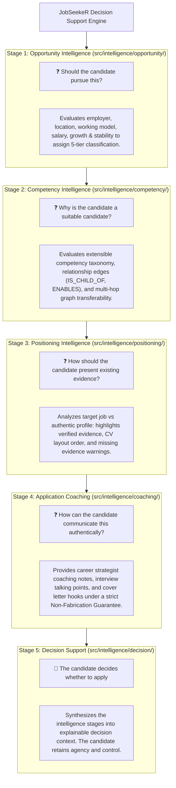

# 📖 JobSeekeR Intelligence Framework v2.0 — Peer Review & Architecture Documentation

**Target Version:** v2.0.0  
**Architectural Model:** Domain-Driven 5-Stage Human-in-the-Loop Decision Support Engine  
**Core Philosophy:** *AI assists. Humans decide.* (Zero fabrication, evidence-first candidate coaching).

> **Documentation status:** This document describes the v2.0 architectural target and preserves a historical QA snapshot. It is not the current repository verification record. For current implementation status, use the README and release checklist together with the current source tree.

---

## 🎯 Executive Summary for Peer Reviewers

JobSeekeR v2.0 transitions the platform from a keyword-matching / content generation app into an **ethical decision support platform** designed to empower job seekers to discover relevant opportunities, position themselves strategically, and apply with confidence.

The engine operates under the AXIS Engineering Framework and SMART Engineering Principles (Strategic, Meaningful, Adaptive, Responsible, Trustworthy).

---

## 🏛️ 5-Stage Decision Support Architecture

Every job evaluation executes through a sequential 5-stage pipeline answering specific human questions:



---

## 📂 Subsystem Directory Structure & Core Modules

| Module Path | Responsible Purpose | Key Exports & Classes |
| :--- | :--- | :--- |
| `src/intelligence/competency/` | Semantic Competency Knowledge Graph & Taxonomy | `CompetencyGraph`, `COMPETENCY_NODES`, `evaluateTransferability()` |
| `src/intelligence/opportunity/` | 5-Tier Opportunity Classifier & Pursuit Advice | `OpportunityEvaluator`, `MatchTier`, `evaluateOpportunity()` |
| `src/intelligence/positioning/` | CV Evidence Layout & Gap Analysis | `PositioningAnalyzer`, `analyzePositioning()` |
| `src/intelligence/coaching/` | Non-Generative Career Strategist Coaching | `ApplicationCoachingAdvisor`, `generateCoaching()` |
| `src/intelligence/decision/` | 5-Stage Decision Context Synthesis | `DecisionSupportEngine`, `evaluateDecisionSupport()` |
| `src/lib/services/matcher.ts` | Integration layer connecting matcher service | `evaluateJobMatch()` |

---

## 🛡️ Core Product & Security Principles

1. **Intelligence Before Generation**: Every workflow follows: `Discover → Analyse → Explain → Recommend → User Approves → Generate`.
2. **Evidence-First Guarantee**: Recommendations strictly prioritize evidence already present in the candidate profile. The engine **never fabricates** experience, achievements, education, or certifications.
3. **5-Tier Opportunity Categorization**:
   - 🌟 `EXCELLENT_MATCH`
   - 🟢 `STRONG_MATCH`
   - 🟡 `POTENTIAL_MATCH`
   - 🚀 `STRETCH_OPPORTUNITY`
   - ⚪ `LOW_PRIORITY`
4. **Input XSS Sanitization**: Input text in titles and descriptions is sanitized using `sanitizeText()` to prevent XSS payloads.

---

## 🧪 Historical v2.0 QA Snapshot

The original v2.0 peer-review snapshot recorded **23 unit tests across 9 test files** with 100% success.

That snapshot is historical evidence of the v2.0 review state. It must not be interpreted as the current repository test count. The current verification baseline is maintained separately and currently records **33 test files / 118 tests passed**.

The historical snapshot covered functional classification and graph paths, malformed/large inputs, performance benchmarking, XSS/non-fabrication checks, visual consistency, accessibility, rationale coverage and exploratory mixed-domain evaluations.

---

## 📌 Instructions for Peer Reviewers

Run the current automated checks from the repository root:

```bash
npx tsc --noEmit
npm test -- --run
npm run build
```

For the current verification status, consult `README.md` and `docs/RELEASE_CHECKLIST.md`.

Inspect the domain graph extensions in `src/intelligence/competency/taxonomy.ts` when reviewing competency relationships or categories.
