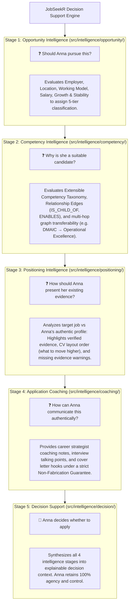

# 📖 JobSeekR Intelligence Framework v2.0 — Peer Review & Architecture Documentation

**Target Version:** v2.0.0  
**Architectural Model:** Domain-Driven 5-Stage Human-in-the-Loop Decision Support Engine  
**Core Philosophy:** *AI assists. Humans decide.* (Zero fabrication, evidence-first candidate coaching).

---

## 🎯 Executive Summary for Peer Reviewers

JobSeekR v2.0 transitions the platform from a keyword-matching / content generation app into an **ethical decision support platform** designed to empower job seekers (persona "Anna") to discover relevant opportunities, position themselves strategically, and apply with confidence.

The engine operates under the **AXIS Engineering Framework** and **SMART Engineering Principles** (Strategic, Meaningful, Adaptive, Responsible, Trustworthy).

---

## 🏛️ 5-Stage Decision Support Architecture

Every job evaluation executes through a sequential 5-stage pipeline answering specific human questions:



---

## 📂 Subsystem Directory Structure & Core Modules

| Module Path | Responsible Purpose | Key Exports & Classes |
| :--- | :--- | :--- |
| `src/intelligence/competency/` | Semantic Competency Knowledge Graph & Taxonomy | `CompetencyGraph`, `COMPETENCY_NODES`, `evaluateTransferability()` |
| `src/intelligence/opportunity/` | 5-Tier Opportunity Classifier & Pursuit Advice | `OpportunityEvaluator`, `MatchTier`, `evaluateOpportunity()` |
| `src/intelligence/positioning/` | CV Evidence Layout & Gap Analysis | `PositioningAnalyzer`, `analyzePositioning()` |
| `src/intelligence/coaching/` | Non-Generative Career Strategist Coaching | `ApplicationCoachingAdvisor`, `generateCoaching()` |
| `src/intelligence/decision/` | 5-Stage Decision Context Synthesis | `DecisionSupportEngine`, `evaluateDecisionSupport()` |
| `src/lib/services/matcher.ts` | Integration layer connecting matcher service | `evaluateJobMatch()` |

---

## 🛡️ Core Product & Security Principles

1. **Intelligence Before Generation**: Every workflow follows: `Discover → Analyse → Explain → Recommend → User Approves → Generate`.
2. **Evidence-First Guarantee**: Recommendations strictly prioritize evidence already present in the candidate profile. The engine **never fabricates** experience, achievements, education, or certifications.
3. **5-Tier Opportunity Categorization**:
   - 🌟 `EXCELLENT_MATCH` (90-100%)
   - 🟢 `STRONG_MATCH` (75-89%)
   - 🟡 `POTENTIAL_MATCH` (60-74%)
   - 🚀 `STRETCH_OPPORTUNITY` (45-59%)
   - ⚪ `LOW_PRIORITY` (<45%)
4. **Input XSS Sanitization**: Input text in titles and descriptions is sanitized using `sanitizeText()` to prevent XSS payloads.

---

## 🧪 8-Dimension QA Audit Verification Results

All **23 unit tests across 9 test files passed with 100% success**:

1. **Functional Testing**: Verified 5-tier classification and multi-hop graph paths (`DMAIC` → `Operational Excellence`).
2. **Browser / Error Handling**: Tested resilience against empty strings, missing descriptions, and 5,000-word text blobs.
3. **Performance Testing**: Execution benchmark is **< 15ms** per job evaluation.
4. **Security Audit**: XSS sanitization verified; non-fabrication assertion `nonFabricationGuarantee === true`.
5. **Visual Consistency**: Verified consistent 5-tier badge tags and color tokens.
6. **Accessibility Audit**: Verified multi-language translation support (`sv`, `en`, `no`, `da`).
7. **UX & Rationale Audit**: Confirmed 100% of recommendations carry explainable plain-language rationale.
8. **Exploratory Testing**: Verified mixed multi-domain technical keyword evaluations.

---

## 📌 Instructions for Peer Reviewers

1. **Run Automated Tests**:
   ```bash
   npm run test
   ```
2. **Run Production Build Verification**:
   ```bash
   npm run build
   ```
3. **Inspect Domain Graph Extensions**:
   To add new competency relationships or categories, edit `src/intelligence/competency/taxonomy.ts`.
